<p align="center">
  
</p>

分布式任务调度平台(Distributed Job Schedule Platform)[](https://travis-ci.org/ihaolin/antares)
---

## Antares特性
	
### 基于Quartz的分布式调度
	
+ 一个任务仅会被服务器集群中的某个节点调度，调度机制基于成熟的[Quartz](http://www.quartz-scheduler.org/)，antares内部会重写执行逻辑；

### 并行执行

+ 用户可通过对任务**预分片**，有效提升任务执行效率；

### 失效转移

+ **客户端实效转移**：当某个客户端实例在执行任务中宕机时，其正在执行的分片将重新由其他客户端实例执行；

+ **服务器失效转移**：当服务器集群中某个节点宕机时，其正在调度的任务将转移到其他节点去调度；

### 弹性扩容
	
+ **客户端扩容**：客户端可通过增加应用实例，提升任务执行的效率；
+ **服务器扩容**：服务器集群可通过增加节点，提升集群任务调度的服务能力； 

### 进程级的应用实例

+ antares通过**ip+进程号**标识客户端应用实例，因此支持**单机多应用实例**部署；

### 任务依赖

+ antares支持**树形任务依赖**，当某任务执行完成后，会通知其**后置任务**执行；

### 任务报警

+ antares支持基本的任务**超时报警**，**失败报警**等；

### 管理控制台

+ 用户可通过控制台**antares-tower**对任务进行基本操作，如**触发**，**暂停**，**监控**等。

## Demo

[在线Demo](http://antares.hao0.me)(用户名/密码：admin/admin123)。

## 名称术语

+ **应用(App)**

	> 用于**标识**或**分组**，如**用户服务**，**订单服务**等；

+ **应用实例(App Instance)**
	
	> 某应用下的客户端实例，即某个**进程实例**；

+ **任务(Job)**
	
	> 即被调度的实体，仅会由某一服务器节点调度；

+ **任务实例(Job Instance)**

	> 每当任务被触发时，则会生产一个**任务实例**，执行完成后，则为**任务历史**；

+ **任务分片(Job Instance Shard)**

	> 即任务的**预分片配置**，包含**分片数**和**分片参数**，用户可通过客户端实例执行任务时被分配的**分片项**及其**分片参数**，自己实现分片逻辑；

+ **分片项(shardItem)、分片参数(shardParam)**

	> 分片项(shardItem)，即当应用实例任务执行时，被分配的**任务下标**，从0开始；分片参数，即**任务下标**对应的**配置参数**。

## 应用场景

通常，对于有以下场景或需求时，可以考虑使用**分布式任务调度**：

+ **需要保证任务执行的高可用性**：即当执行任务的应用实例崩溃后，其他应用实例可以继续执行该任务；

+ **要求任务执行效率足够高**：在业务数据量级比较大时，可以使用**预分片配置**来将数据进行**逻辑分片**，使得多个应用实例能并行执行任务分片，以提升任务的执行效率。

## Antares架构

### Antares整体架构
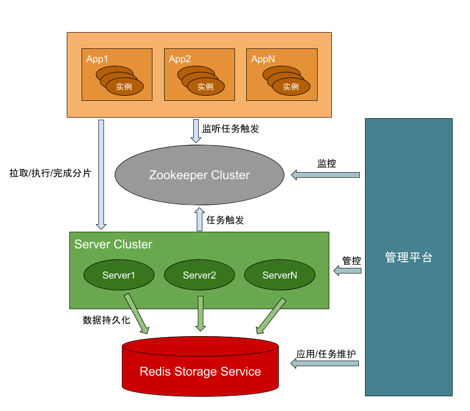

### Antares中的任务状态机
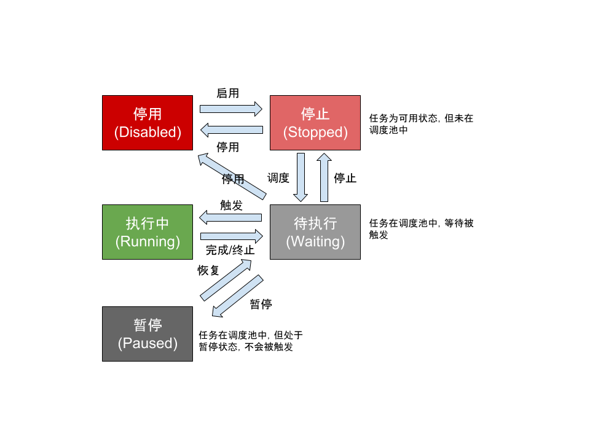

## 快速开始

### 环境准备

+ jdk7+；
+ [Redis](http://redis.io/);
+ [Zookeeper](https://zookeeper.apache.org/);

### 编译打包

+ [下载](https://github.com/ihaolin/antares/releases)最新的压缩包；

+ 或者通过源码构建:

	```bash
	mvn clean package -DskipTests -Prelease
	```

#### 安装服务器([antares-server](antares-server))

+ 解压安装包：

	```bash
	tar zxf antares-server-{version}.tar.gz
	ll antares-server-{version}
	bin		# 执行脚本
	conf	# 配置目录
	lib		# 依赖包
	```

+ 编辑配置文件`antares.conf`：
	
	```bash
	# 服务器绑定的IP
	BIND_ADDR=127.0.0.1
	
	# 服务器的监听端口
	LISTEN_PORT=22122
	
	# Redis主机地址
	REDIS_HOST=127.0.0.1
	
	# Redis主机端口
	REDIS_PORT=6379
	
	# Redis的数据键前缀
	REDIS_NAMESPACE=ats
	
	# 日志目录，相对或绝对路径
	LOG_PATH=./logs
	
	# Zookeeper地址
	ZK_SERVERS=127.0.0.1:2181
	
	# Zookeeper命名空间
	ZK_NAMESPACE=ats
	
	# 服务器宕机后，启动Failover前的等待时间(单位为秒，通常大于服务器正常重启的时间，避免因为重启服务器，导致不必要的Failover)
	SERVER_FAILOVER_WAIT_TIME=30
	
	# 调度器的线程数
	SCHEDULE_THREAD_COUNT=32
	
	# JVM堆参数
	JAVA_HEAP_OPTS="-Xms512m -Xmx512m -XX:MaxNewSize=256m"
	```
	
+ 启动/关闭/重启服务器：

	```bash
	./bin/antares.sh start
	./bin/antares.sh stop
	./bin/antares.sh restart
	```

#### 安装控制台([antares-tower](antares-tower))

+ 解压安装包：

	```bash
	tar zxf antares-tower-{version}.tar.gz
	ll antares-tower-{version}
	bin		# 执行脚本
	conf	# 配置目录
	lib		# 依赖包
	```

+ 编辑配置文件`antares.conf`：
	
	```bash
	# 控制台绑定的IP
	BIND_ADDR=127.0.0.1
	
	# 控制台的监听端口
	LISTEN_PORT=22111
	
	# Redis的主机地址
	REDIS_HOST=127.0.0.1
	
	# Redis的端口
	REDIS_PORT=6379
	
	# Redis的数据键前缀
	REDIS_NAMESPACE=ats
	
	# 日志目录，相对或绝对路径
	LOG_PATH=./logs
	
	# Zookeeper地址127.0.0.1
	ZK_SERVERS=127.0.0.1:2181
	
	# Zookeeper命名空间
	ZK_NAMESPACE=ats
	
	# 控制台用户名
	TOWER_USER=admin
	
	# 控制台密码
	TOWER_PASS=admin
	
	# JVM堆参数配置
	JAVA_HEAP_OPTS="-Xms512m -Xmx512m -XX:MaxNewSize=256m"
	
	# 是否开启报警
	ALARM_ENABLE=false
	
	## 若ALARM_ENABLE=false，下面的配置可以忽略
	
	# 通知类型(暂仅支持邮件)
	# 1：邮件
	ALARM_NOTIFY_TYPE=1
	
	# 报警标题
	ALARM_SUBJECT=Antares任务报警
	
	# 任务超时报警模版，以下四个变量可用，使用{}开头结尾
	ALARM_TEMPLATE_JOB_TIMEOUT=应用【{appName}】的任务【{jobClass}】执行超时，调度服务器为【{scheduler}】：{detail}.
	
	# 任务失败报警模版，以下四个变量可用，使用{}开头结尾
	ALARM_TEMPLATE_JOB_FAILED=应用【{appName}】的任务【{jobClass}】执行失败，调度服务器为【{scheduler}】：{detail}.
	
	### 邮件配置
	# 邮箱主机
	MAIL_HOST=192.168.0.1
	
	# 发件人邮箱
	MAIL_FROM_ADDR=haolin.h0@gmail.com
	
	# 发件人用户名
	MAIL_FROM_USER=haolin.h0
	
	# 发件人密码
	MAIL_FROM_PASS=123456
	
	# 收件人列表，逗号隔开
	MAIL_TO=haolin.h0@gmail.com
	```
	
+ 启动/关闭/重启控制台：

	```bash
	./bin/antares.sh start
	./bin/antares.sh stop
	./bin/antares.sh restart
	```

+ 这样便可以进入控制台(如<a>http://127.0.0.1:22111</a>)，在控制台事先添加应用及任务：

	+ 编辑应用：

		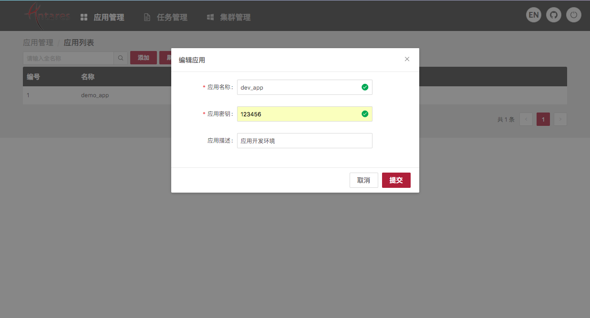
	
	+ 编辑任务：

		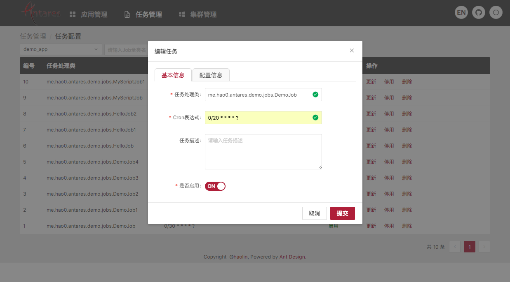

### 客户端使用

#### 基础知识

+ **Job类型**：antares支持两种Job类型，[DefaultJob](antares-client/src/main/java/me/hao0/antares/client/job/DefaultJob.java)和[ScriptJob](antares-client/src/main/java/me/hao0/antares/client/job/script/ScriptJob.java):
	
	+ [DefaultJob](antares-client/src/main/java/me/hao0/antares/client/job/DefaultJob.java)为最常用的Job类型，开发人员只需要实现该接口即可，如：

		```java
		public class DemoJob implements DefaultJob {
		
		    @Override
		    public JobResult execute(JobContext context) {
		        
		        // 可以获取到当前应用实例被分配的分片信息
		        // 分片号，从0开始
		        context.getShardItem(); 
		        // 分片号对应的分片参数
		        context.getShardParam();
		        
		        // 执行任务逻辑...
		        // 如有需要，可通过分片信息处理不同的数据集
		        // 注意catch异常
		        		    
		        return JobResult;
		    }
		}
		```
	+ 实现[DefaultJob](antares-client/src/main/java/me/hao0/antares/client/job/DefaultJob.java)的任务类的返回结果有三种类型：
		
		+ <font color="green">JobResult.SUCCESS</font>：分片执行成功；
		
		+ <font color="red">JobResult.FAIL</font>：分片执行失败，可以通过```JobResult.failed(error)```返回，可记录对应的错误信息，便于排查问题；
		
		+ <font color="gray">JobResult.LATER</font>：重新分配，这将使得当前分片会重新被分配执行。
		
	+ [ScriptJob](antares-client/src/main/java/me/hao0/antares/client/job/script/ScriptJob.java)为**脚本任务**，开发人员只需要继承该类，不需要具体的实现代码，然后配置Job的自定义参数，即为**需要执行的命令**，如：
	
		```java
		/**
		 * 只需继承ScriptJob即可
		 */
		public class MyScriptJob extends ScriptJob {
		
		}
		```
		
		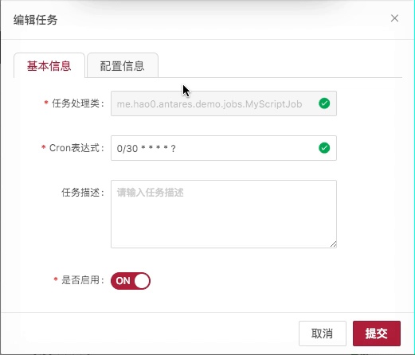

+ **Job分片配置**：Job分片配置，主要用于将业务数据进行逻辑分片，需要开发人员自行实现分片逻辑，**分片配置**只是协助开发人员进行分片，这些配置通常比较有规律，同一应用实例同一时刻只会分配到其中一片，执行完，再拉取其他剩余的任务分片，直到任务执行完成，如：

	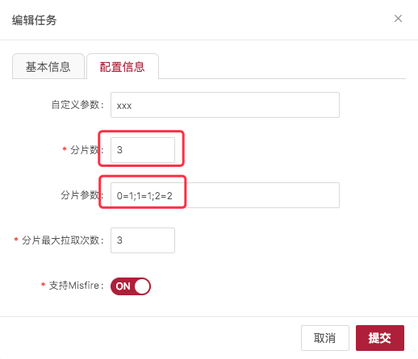
	
	> **分片参数**由分号隔开，从0开始，每个参数可以是数字，字母或是JSON字符串，比如上面将任务分为3片，这3片对应的参数为**0，1，2**，我们可以假定将业务数据分为三份，第1份表示记录**id % 3 = 0**的数据，第2份为记录**id % 3 = 1**的数据，第3份为记录**id % 3 = 2**的数据。更常见的场景可能是在**分库分表**时，同分片参数去划分不同的库或表，当然，如果**数据量不大**或**任务执行的时间可接受**，也不用分片。

#### 客户端使用(编程模式)

+ 引入maven包：

	```xml
	<dependency>
        <groupId>me.hao0</groupId>
        <artifactId>antares-client</artifactId>
        <version>1.3.1</version>
    </dependency>
	```

+ **antares-client**日志处理使用的是**slf4j-api**，开发人员只需额外引入其实现即可，如log4j，log4j2，logback等，zookeeper操作主要依赖**curator**，若有版本冲突，注意解决。

+ 启动**SimpleAntaresClient**：

	```java
	SimpleAntaresClient client = 
			new SimpleAntaresClient(
				"dev_app", 			// 应用名称
				"123456", 			// 应用密钥
				"127.0.0.1:2181",	// zookeeper地址 
				"ats"               // zookeeper命名空间
			);				
	
	// 执行任务的线程数
	client.setExecutorThreadCount(32);
	
	// 启动客户端			
	client.start();
	
	// 创建job实例，需要实现DefaultJob或ScriptJob
	DemoJob demoJob = new DemoJob();
	
	// 注册job
	client.registerJob(demoJob);
	
	```

+ 具体可见[单元测试](antares-client/src/test/java/me/hao0/antares/client/SimpleAntaresClientTest.java)。

#### 客户端使用(Spring模式)

+ 引入maven包：

	```xml
	<dependency>
        <groupId>me.hao0</groupId>
        <artifactId>antares-client-spring</artifactId>
        <version>1.3.1</version>
    </dependency>
	```

+ 在Spring上下文配置**SpringAntaresClient**，及其Job实例即可：

	```xml
	<!-- Spring Antares Client -->
	<bean class="me.hao0.antares.client.core.SpringAntaresClient">
		<!-- 应用名称 -->
		<constructor-arg index="0" value="dev_app" />
		<!-- 应用密钥 -->
		<constructor-arg index="1" value="123456" />
		<!-- zookeeper地址 -->
		<constructor-arg index="2" value="127.0.0.1:2181" />
		<!-- zookeeper命名空间 -->
		<constructor-arg index="2" value="ats" />
		<!-- 执行job的线程数 -->
		<property name="executorThreadCount" value="32" />
	</bean>

	<!-- Job实例 -->
	<bean class="me.hao0.antares.demo.jobs.DemoJob" />
	
	<!-- ... -->
	
	```

+ 具体可见[单元测试](antares-client-spring/src/test/java/me/hao0/antares/client/SpringAntaresClientTest.java)。

#### 客户端使用(Spring Boot Starter模式)

+ 引入maven包：

	```xml
	<dependency>
        <groupId>me.hao0</groupId>
        <artifactId>antares-client-spring-starter</artifactId>
        <version>1.3.1</version><!-- 1.3.0+ -->
    </dependency>
	```


+ 在**application.yml**中引入**antares**相关配置即可：

	```yml
	antares:
	  appName: myapp
	  appSecret: 123456
	  zkServers: localhost:2181
	  zkNamespace: ats
	  executorThreadCount: 32
	```

+ 具体参考可见[antares-demo-spring-starter](antares-demo-spring-starter/)。

#### Job监听

+ 对于想做一些任务监听的操作，开发人员可选择实现[JobListener](antares-client/src/main/java/me/hao0/antares/client/job/listener/JobListener.java)或[JobResultListner](antares-client/src/main/java/me/hao0/antares/client/job/listener/JobResultListener.java)，如：

	```java
	public class DemoJob implements DefaultJob, JobListener, JobResultListener {
		
		@Override
		public JobResult execute(JobContext context) {
	       return ...
		}

	    @Override
	    public void onBefore(JobContext context) {
	        // 任务执行前调用
	    }
	    
	    @Override
	    public void onAfter(JobContext context, JobResult res) {
		     // 任务执行后调用
	    }
	
	    @Override
	    public void onSuccess() {
	        // 任务执行成功后调用
	    }
	
	    @Override
	    public void onFail() {
	        // 任务执行失败后调用
	    }
	}
	```

#### 使用控制台

应用运行过程中，开发人员便可通过控制台作一些基本操作，如：

+ 应用管理：
	
	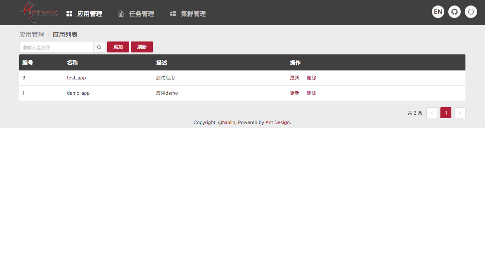

+ 任务配置：

	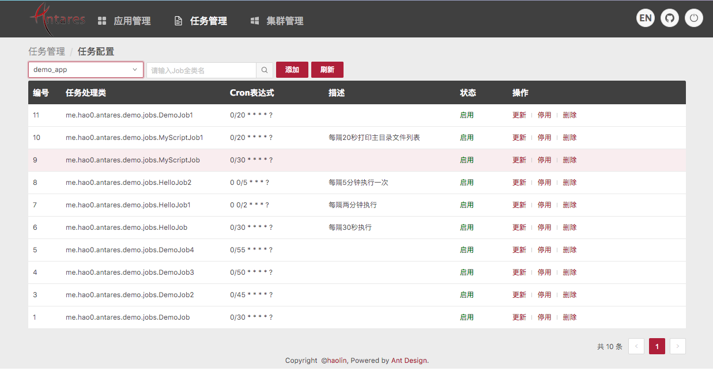

+ 任务依赖：

   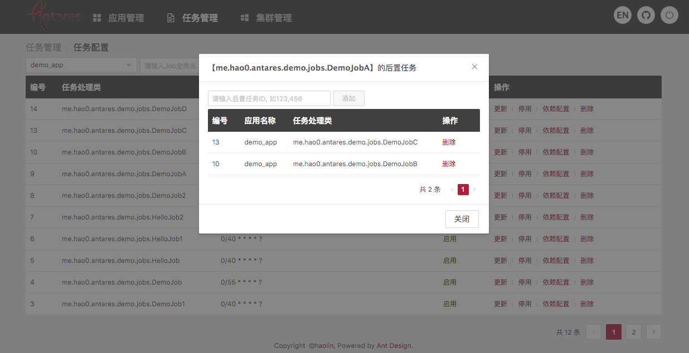

+ 任务管控：

	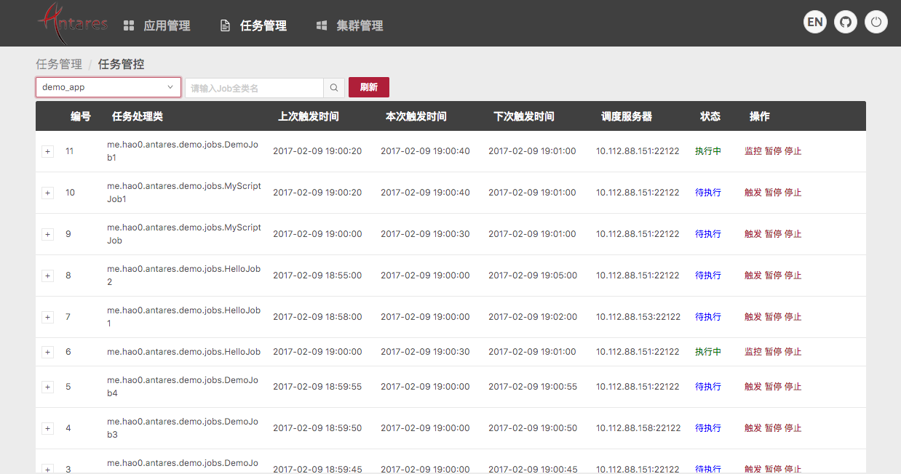

+ 任务历史：

	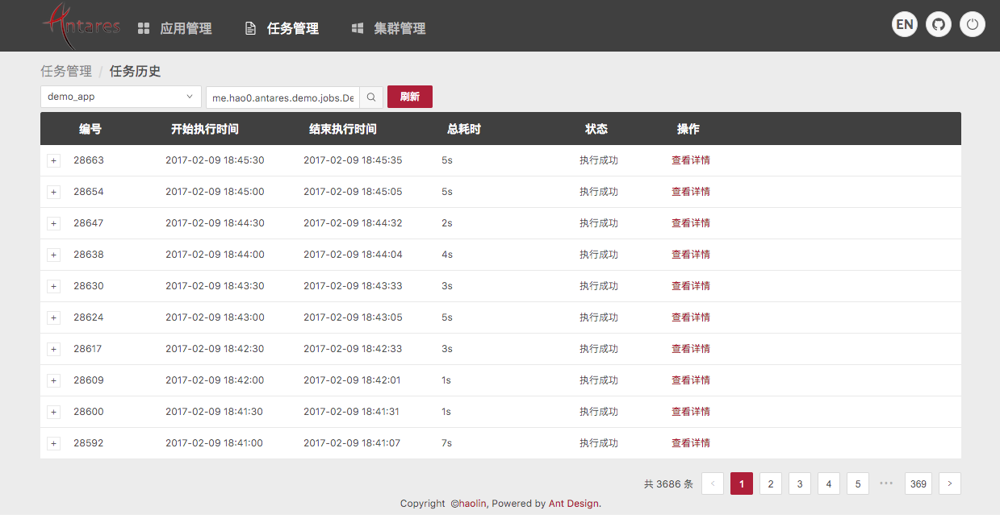

+ 集群管理：

	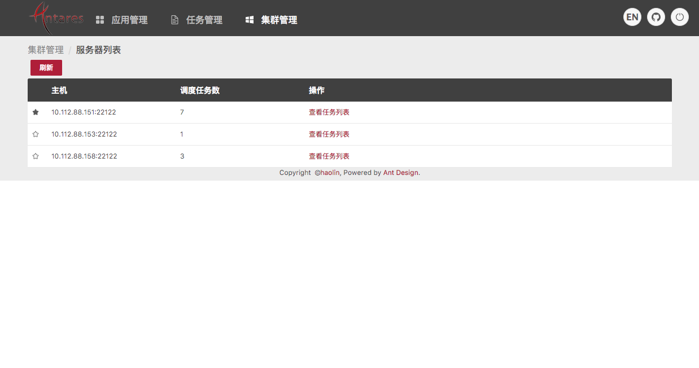
	
	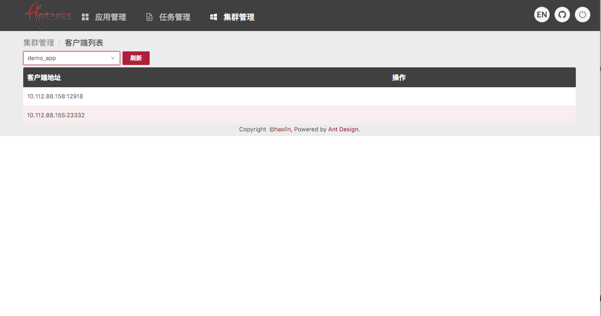

## 最佳实践

+ 应将**任务应用**与**业务应用**独立部署，这两类系统不应相互影响，无论从其属性还是运行环境(如**GC**)都是有区别的；

+ 对任务配置合理的cron表达式，应保证**任务执行的间隔时间**大于**任务执行的总时间**，以免**同一时刻同一任务**发生多次触发执行(<font color="red">antares同一任务同一时刻，只会有一个实例在执行</font>)，其余情况将取决于[Quartz的misfire机制](https://dzone.com/articles/quartz-scheduler-misfire)； 

+ 为了防止任务分片重复执行，应用应尽量保证**幂等性**；

+ 合理划分应用，单个任务应用的任务数量不宜太多(如**2 * executorThreadCount**)，防止单个应用实例执行任务太多，影响任务执行效率。

## 常见问题

+ 有任何问题，请[issue](https://github.com/ihaolin/antares/issues/new)。

## 有事请烧钱

+ 支付宝:
	
	
	
+ 微信:
   
      